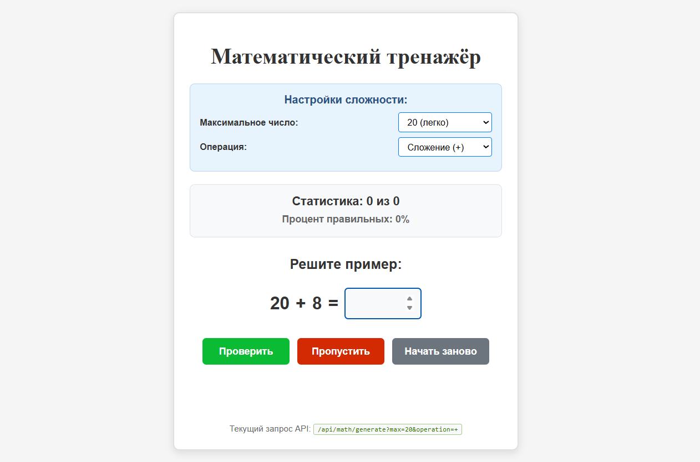
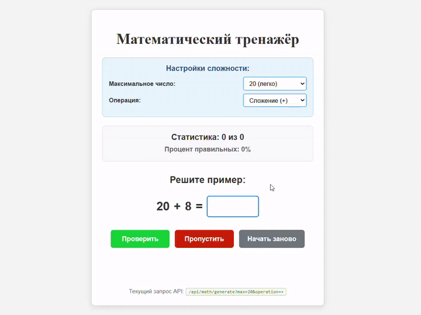
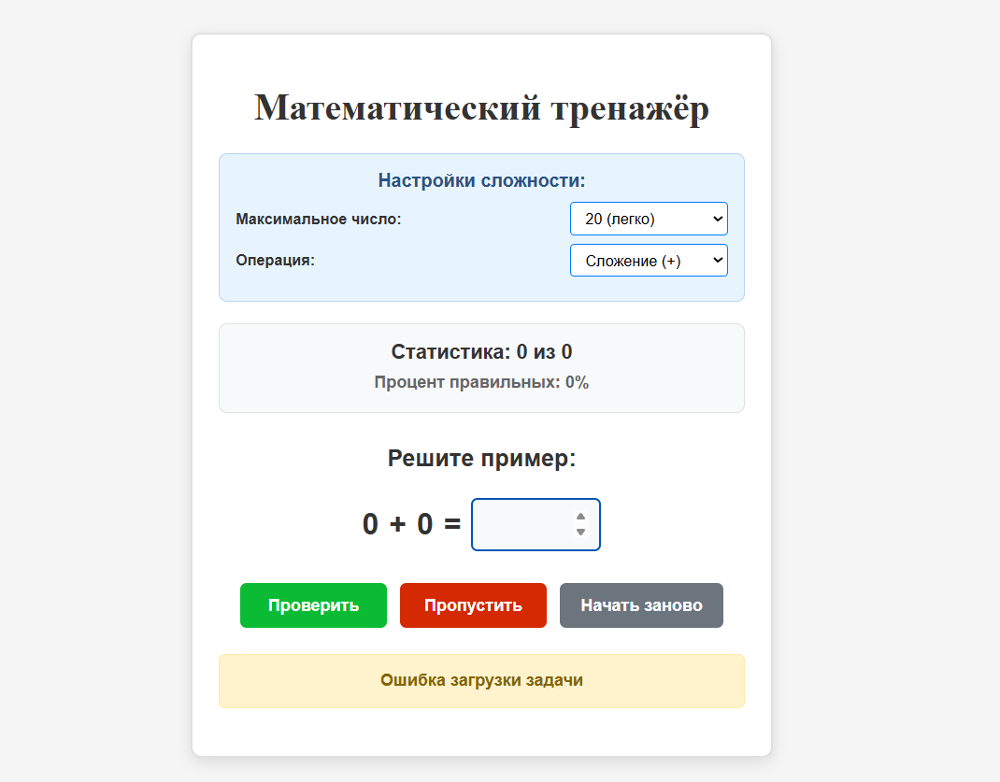

# 🧮 Математический тренажёр

Простое Express-приложение для тренировки математических навыков.

---

## 📦 Запуск

### 🖨️ Клонировать репозиторий

```bash
git clone https://github.com/DmchFast/express-math-trainer.git
cd express-math-trainer
```

---

### 📥 Установить зависимости

```bash
npm install
```

---

### 🖥 Запустить сервер

```bash
npm run dev
```

---

### 🌐 Открыть в браузере

http://localhost:6700

---

## 🎥 Демонстрация

### Примерный сценарий использования


---

## 🖼️ Скриншоты

### ✅ Вид программы при верном ответе


---

### ❌ Вид программы при не верном ответе


---

### ⚠️ Вид программы при ошибке загрузки задачи


---

## 🚀 Функции

- Генерация случайных примеров
- Поддержка 4 операций: `+`, `-`, `×`, `÷`
- Выбор сложности примеров (максимальное число)
- Проверка введённых ответов
- Подсчёт статистики правильных ответов
- Автоматический переход к следующему примеру

---

## 🛠 Технологии

- Node.js
- Express.js
- HTML
- CSS

---

## Выводы по выполненной работе

- Создано полнофункциональное Express.js приложение
- Реализован функционал тренажёра по математике
- Приложение имеет интуитивно понятный интерфейс
- Код хорошо структурирован и легко расширяем
- Присутствует работа с query-параметрами, middleware, маршрутизацией
